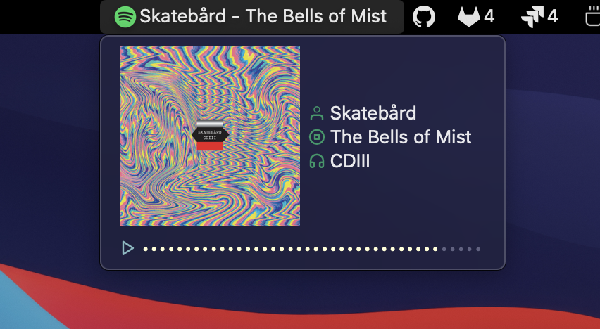

# Spotify

A menubar app which shows currely playing song on Spotify, when clicked shows following menu, with details of the track:



Click on the first item of the menu toggles the playback.

# Installation

 - install [Hammerspoon](http://www.hammerspoon.org/) - a powerfull automation tool for OS X
   - Manually:

      Download the [latest release], and drag Hammerspoon.app from your Downloads folder to Applications.
   - Homebrew:

      ```brew install hammerspoon --cask```

 - download [spotify-mini-player.spoon](), unzip and double click on a .spoon file. It will be installed under `~/.hammerspoon/Spoons` folder.
 
 - open ~/.hammerspoon/init.lua and add the following snippet, adding your parameters:

```lua
-- Spotify mini player
hs.loadSpoon("spotify-mini-player")
spoon['spotify-mini-player']:start()
spoon['spotify-mini-player']:bindHotkeys(
  {
    next={{"alt"}, "."},
    prev={{"alt"}, ","},
    playpause={{"alt"}, "/"}
  }
)
```

The config above sets up the ollowing shortcuts:

 - <kbd>⌥</kbd> + <kbd>,</kbd> - play next track
 - <kbd>⌥</kbd> + <kbd>.</kbd> - play previous track
 - <kbd>⌥</kbd> + <kbd>/</kbd> - play/pause
